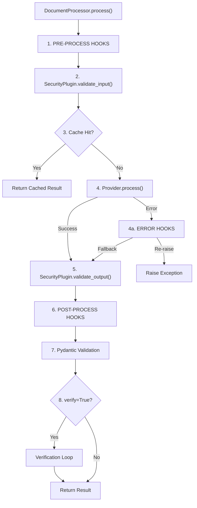

# Plugin System

Everything in strutex is pluggable. Use defaults or register your own implementations.

!!! note "New in v0.3.0"
Plugin System v2 introduces auto-registration via inheritance, lazy loading, entry points, priority-based ordering, and CLI tooling.

---

## Architecture: Plugins vs Hooks

Strutex has two extension mechanisms that serve different purposes:

```
┌─────────────────────────────────────────────────────────────────┐
│                     DocumentProcessor.process()                  │
├─────────────────────────────────────────────────────────────────┤
│                                                                  │
│  ┌─── HOOKS (Observers) ───┐                                     │
│  │ • pre_process           │ ◄── Logging, timing, prompt mods   │
│  └─────────────────────────┘                                     │
│              │                                                   │
│              ▼                                                   │
│  ┌─── PLUGINS (Components) ─┐                                    │
│  │ • SecurityPlugin         │ ◄── Validates input               │
│  │ • Extractor              │ ◄── PDF → text                    │
│  │ • Provider               │ ◄── LLM call                      │
│  │ • Validator              │ ◄── Validates output              │
│  │ • Postprocessor          │ ◄── Transforms result             │
│  └──────────────────────────┘                                    │
│              │                                                   │
│              ▼                                                   │
│  ┌─── HOOKS (Observers) ───┐                                     │
│  │ • post_process          │ ◄── Add metadata, notifications    │
│  │ • on_error              │ ◄── Fallbacks, alerting            │
│  └─────────────────────────┘                                     │
│                                                                  │
└─────────────────────────────────────────────────────────────────┘
```

### When to Use Which?

| Feature         | Plugins (Base Classes)                         | Hooks System                                         |
| --------------- | ---------------------------------------------- | ---------------------------------------------------- |
| **Pattern**     | Strategy Pattern                               | Observer/Middleware Pattern                          |
| **Role**        | **Drivers** — define _how_ a step is performed | **Observers** — react to pipeline events             |
| **Cardinality** | **1:1** — one Provider, one Extractor per run  | **1:N** — many hooks can run simultaneously          |
| **Complexity**  | Higher — implement interface methods           | Lower — just a function or decorator                 |
| **Goal**        | Interchangeability — replace the engine        | Cross-cutting concerns — add without touching engine |

**Use a Plugin when:**

- Changing the **fundamental logic** (e.g., "use OCR instead of text extraction")
- Replacing a core component (different LLM provider)

**Use a Hook when:**

- **Observing** events (logging, timing, metrics)
- **Modifying** data generically (add metadata to all results)
- **Handling errors** (fallbacks, alerting)

---

## Processing Pipeline Flow

When you call `DocumentProcessor.process()`, plugins and hooks are invoked in this order:



### Step-by-Step Breakdown

| Step   | Component                        | Purpose                                   |
| ------ | -------------------------------- | ----------------------------------------- |
| **1**  | Pre-process Hooks                | Modify prompt, add context, log start     |
| **2**  | SecurityPlugin.validate_input()  | Sanitize input, detect injection attacks  |
| **3**  | Cache                            | Return cached result if available         |
| **4**  | Provider.process()               | Send document + prompt to LLM             |
| **4a** | Error Hooks                      | Handle failures, return fallback          |
| **5**  | SecurityPlugin.validate_output() | Clean/validate extracted data             |
| **6**  | Post-process Hooks               | Transform result, normalize data          |
| **7**  | Pydantic Validation              | Validate against model (if provided)      |
| **8**  | Verification Loop                | LLM self-checks output (if `verify=True`) |

### Example: Full Pipeline with All Plugin Types

```python
from strutex import DocumentProcessor
from strutex.providers import GeminiProvider
from strutex.security import SecurityChain, InputSanitizer
from strutex.plugins import Validator, Postprocessor, ValidationResult

# Custom Validator
class TotalValidator(Validator):
    def validate(self, data, schema=None):
        items = data.get("line_items", [])
        total = data.get("total", 0)
        items_sum = sum(i.get("amount", 0) for i in items)

        return ValidationResult(
            valid=abs(items_sum - total) < 0.01,
            data=data,
            issues=[] if abs(items_sum - total) < 0.01 else ["Sum mismatch"]
        )

# Custom Postprocessor
class DateNormalizer(Postprocessor):
    def process(self, data):
        if "date" in data:
            data["date"] = data["date"].replace("/", "-")
        return data

# Setup processor with plugins
processor = DocumentProcessor(
    provider=GeminiProvider(),
    security=SecurityChain([InputSanitizer()])
)

# Add hooks
@processor.on_pre_process
def log_start(file_path, prompt, schema, mime_type, context):
    print(f"Processing: {file_path}")

@processor.on_post_process
def add_metadata(result, context):
    result["_processed_by"] = "strutex"
    return result

@processor.on_error
def handle_rate_limit(error, file_path, context):
    if "rate limit" in str(error).lower():
        return {"error": "Rate limited", "retry": True}
    return None  # Re-raise other errors

# Process with full pipeline
result = processor.process(
    "invoice.pdf",
    "Extract invoice data",
    model=InvoiceSchema,
    verify=True  # Enable verification loop
)
```

## Plugin Types

| Type            | Purpose                 | Built-in Examples                       |
| --------------- | ----------------------- | --------------------------------------- |
| `provider`      | LLM backends            | Gemini, OpenAI                          |
| `security`      | Input/output protection | InputSanitizer, PromptInjectionDetector |
| `extractor`     | Document parsing        | PDF, Image, Excel                       |
| `validator`     | Output validation       | Schema, business rules                  |
| `postprocessor` | Data transformation     | DateNormalizer                          |

The `PluginType` enum provides type-safe access:

```python
from strutex.plugins import PluginType

PluginType.PROVIDER      # "provider"
PluginType.EXTRACTOR     # "extractor"
PluginType.VALIDATOR     # "validator"
PluginType.POSTPROCESSOR # "postprocessor"
PluginType.SECURITY      # "security"
```

---

## Quick Start

### Auto-Registration via Inheritance

Simply inherit from a base class and your plugin is automatically registered:

```python
from strutex.plugins import Provider

class MyProvider(Provider):
    """Auto-registered as 'myprovider'"""
    capabilities = ["vision"]

    def process(self, file_path, prompt, schema, mime_type, **kwargs):
        return {"result": "data"}
```

That's it! No decorators or manual registration needed.

### Customizing Registration

Use class arguments to customize the name:

```python
class FastProvider(Provider, name="fast"):
    """Registered as 'fast' with high priority"""
    priority = 90  # Priority is a class attribute
    cost = 0.5
    capabilities = ["vision", "batch"]

    def process(self, *args, **kwargs):
        ...
```

### Opting Out of Auto-Registration

For intermediate base classes:

```python
class BasePdfProvider(Provider, register=False):
    """NOT registered - abstract base class"""
    def common_pdf_logic(self):
        ...

class AdobeProvider(BasePdfProvider):
    """Registered as 'adobeprovider'"""
    def process(self, *args, **kwargs):
        ...
```

!!! tip
Classes with unimplemented `@abstractmethod`s are automatically skipped.

---

## Plugin Attributes

| Attribute                | Type    | Default | Description                                    |
| ------------------------ | ------- | ------- | ---------------------------------------------- |
| `strutex_plugin_version` | `str`   | `"1.0"` | API version for compatibility                  |
| `priority`               | `int`   | `50`    | Order in waterfall (0-100, higher = preferred) |
| `cost`                   | `float` | `1.0`   | Cost hint (lower = cheaper)                    |
| `capabilities`           | `list`  | `[]`    | Features this plugin supports                  |

---

## Registration Methods

### 1. Auto-Registration (Recommended)

Just inherit from a base class:

```python
class MyProvider(Provider):
    def process(self, ...): ...
# → Registered as "myprovider"

class MyProvider(Provider, name="custom"):
    def process(self, ...): ...
# → Registered as "custom"
```

### 2. Entry Points (For Packages) {: #entry-points }

For distributable packages, register in `pyproject.toml`:

```toml
[project.entry-points."strutex.providers"]
my_provider = "my_package:MyProvider"

[project.entry-points."strutex.validators"]
my_validator = "my_package:MyValidator"
```

Plugins are **lazy loaded** — only imported when first used.

### 3. Manual Registration

```python
from strutex.plugins import PluginRegistry

PluginRegistry.register("provider", "my_provider", MyProvider)
```

---

## CLI Commands

```bash
# List all plugins
strutex plugins list

# Filter by type
strutex plugins list --type provider

# JSON output
strutex plugins list --json

# Plugin details
strutex plugins info gemini --type provider

# Refresh discovery cache
strutex plugins refresh
```

---

## Creating Custom Plugins

### Custom Provider

```python
from strutex.plugins import Provider

class OllamaProvider(Provider):
    priority = 60
    capabilities = ["local", "vision"]

    def __init__(self, model="llama3"):
        self.model = model

    def process(self, file_path, prompt, schema, mime_type, **kwargs):
        # Your implementation
        ...
```

### Custom Validator

```python
from strutex.plugins import Validator, ValidationResult

class SumValidator(Validator):
    """Verify line items sum to total."""
    priority = 70

    def validate(self, data, schema=None):
        items_sum = sum(i.get("amount", 0) for i in data.get("items", []))
        total = data.get("total", 0)

        if abs(items_sum - total) > 0.01:
            return ValidationResult(
                valid=False,
                data=data,
                issues=[f"Sum mismatch: {items_sum} != {total}"]
            )
        return ValidationResult(valid=True, data=data)
```

### Custom Postprocessor

```python
from strutex.plugins import Postprocessor
import re

class DateNormalizer(Postprocessor):
    """Convert DD.MM.YYYY to YYYY-MM-DD."""

    def process(self, data):
        result = data.copy()
        if "date" in result:
            match = re.match(r'(\d{2})\.(\d{2})\.(\d{4})', result["date"])
            if match:
                d, m, y = match.groups()
                result["date"] = f"{y}-{m}-{d}"
        return result
```

---

## API Reference

::: strutex.plugins.PluginRegistry
options:
show_root_heading: true
members: - register - get - list - discover

::: strutex.plugins.Provider
options:
show_root_heading: true
